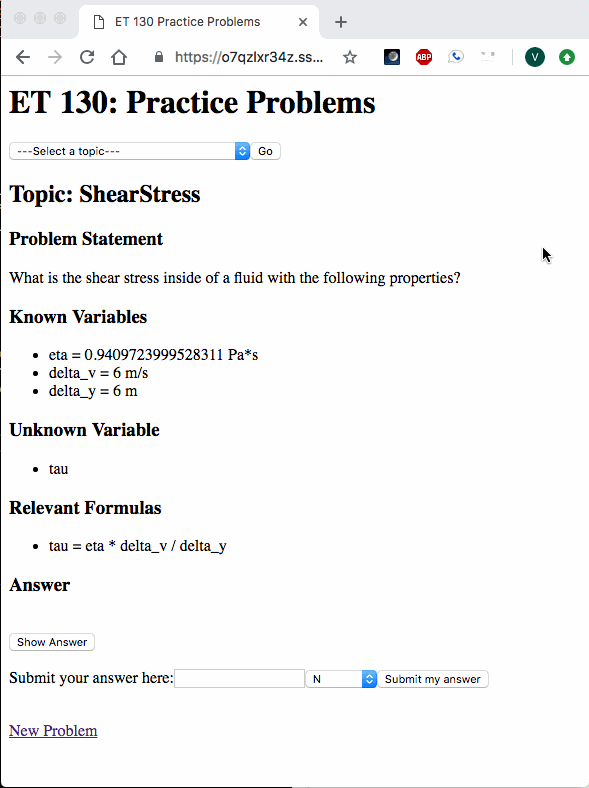

# Six Week Version
1. What is impossible to do manually?
   - Access the web app--time to deploy!
2. What is the next most annoying task to do manually?
   - Teacher keeps track of student progress
3. What is the next most annoying task to do manually?
   - Try to enjoy the current UI

# Four Week Version

1. What is the next most annoying task to do manually?
   - Wait until problem from desired topic is randomly generated
2. What is the next most annoying task to do manually?
   - Hide the answer before attempting the problem
3. What is the next most annoying task to do manually?
   - Keeping track of their performance on the problems
   
## Core Functionality
   - Students can generate new problems, view the answer when they desire to do so, and track their perfomance for each topic.

# Two Week Version

1. What task is impossible to do manually?
   - Students: create their own practice problems and answers
   - Teachers: create unlimited practice problems and answers
## Core Functionality
   - Generate practice problems for students

