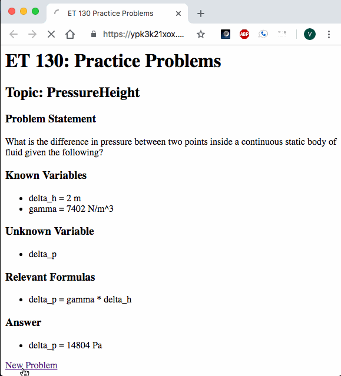

# Four Week Version

1. What is the next most annoying task to do manually?
   - Hide the answer before attempting the problem
2. What is the next most annoying task to do manually?
   - Keeping track of their performance on the problems
   
## Core Functionality
   - Students can generate new problems, view the answer when they desire to do so, and track their perfomance for each topic.
   
# Two Week Version

1. What task is impossible to do manually?
   - Students: create their own practice problems and answers
   - Teachers: create unlimited practice problems and answers
## Core Functionality
   - Generate practice problems for students

